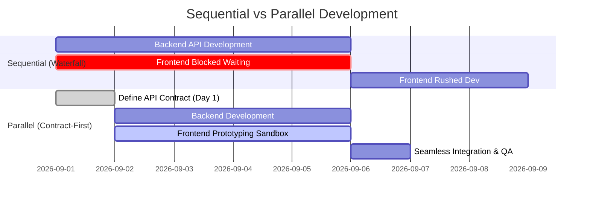

# Stop Waiting for the Backend: A Frontend Developer's Guide to API Prototyping

**Suggested URL Slug:** `frontend-api-prototyping-guide`  
**Primary Keyword:** `frontend API prototyping`  
**Secondary Keywords:** `API contract first development`, `parallel frontend backend workflow`, `mock API prototyping`, `React API integration`  
**Meta Description:** Discover how frontend teams can work in parallel with backend engineers using API contracts, stateful mock sandboxes, and zero-downtime endpoint switching.  
**Suggested Dev.to Tags:** `#productivity`, `#webdev`, `#frontend`, `#career`

---

Here is a common scenario in software teams:

Sprint planning begins on Monday. The product manager outlines an exciting new feature: a customer analytics dashboard with interactive filters, CRUD management, and real-time updates.

The backend team estimates their API work at 5 days.  
The frontend team is told: *"You can start building the UI once our database migrations and API endpoints are merged on Friday."*

This creates an artificial bottleneck. Frontend engineers are forced to wait, rush their UI implementation over the weekend, or write throwaway mock adapters that must be rewritten when the real backend arrives.

It does not have to be this way. By adopting **API Prototyping and Contract-First Development**, frontend developers can build, test, and ship complete, interactive interfaces in parallel with the backend team.

---

## The Waterfall Trap vs. Parallel Track Development

When teams develop sequentially, every delay in the backend blocks the frontend. When teams develop in parallel, both teams agree on a shared **API Contract** on day one:



By decoupling the frontend from the physical backend implementation, frontend engineers can:
1. Validate user experience and design assumptions early.
2. Build realistic error and loading states.
3. Share interactive staging demos with product managers and stakeholders days ahead of schedule.

---

## The 4 Steps to Successful Frontend API Prototyping

### Step 1: Agree on the API Contract
Before writing code, both teams establish the endpoint paths, HTTP verbs, payload shapes, and status codes. For example:
- `GET /api/v1/posts?_page=1&_limit=10` &rarr; Returns paginated posts.
- `POST /api/v1/posts` &rarr; Body: `{ title: string, body: string, user_id: number }`.
- `DELETE /api/v1/posts/:id` &rarr; Returns `200 OK`.

### Step 2: Connect to a Zero-Config Stateful Sandbox
Instead of building a temporary Node.js Express server on your machine that only you can access, use a hosted stateful sandbox like [Playground API](https://playground.nileslabs.com) by Niles Labs.

Playground API provides pre-seeded datasets (users, posts, comments, todos) with full support for:
- CRUD mutations that persist per session
- Sorting (`?_sort=title&_order=asc`)
- Pagination (`?_page=1&_limit=10`)
- Latency injection (`?_delay=1000`)
- Error simulation (`?_status=500`)

### Step 3: Abstract Your API Layer with an Environment Variable
Always isolate your base API URL in an environment configuration file:

```typescript
// src/config/api.ts
export const API_BASE_URL = 
  process.env.NEXT_PUBLIC_API_URL || 'https://playground.nileslabs.com/api/v1';
```

```typescript
// src/services/postService.ts
import { API_BASE_URL } from '../config/api';

export interface Post {
  id: number;
  title: string;
  body: string;
  user_id: number;
}

export async function getPosts(page = 1, limit = 10): Promise<Post[]> {
  const res = await fetch(`${API_BASE_URL}/posts?_page=${page}&_limit=${limit}`);
  if (!res.ok) throw new Error(`HTTP error ${res.status}`);
  return res.json();
}

export async function createPost(payload: Omit<Post, 'id'>): Promise<Post> {
  const res = await fetch(`${API_BASE_URL}/posts`, {
    method: 'POST',
    headers: { 'Content-Type': 'application/json' },
    body: JSON.stringify(payload),
  });
  if (!res.ok) throw new Error('Failed to create post');
  return res.json();
}
```

### Step 4: The Zero-Friction Switch to Production
When Friday arrives and the backend team deploys their service, you don’t need to rewrite your React components or modify fetch hooks.

You simply update your `.env.production` file:

```bash
# Before (Prototyping Sandbox)
NEXT_PUBLIC_API_URL=https://playground.nileslabs.com/api/v1

# After (Production Backend Ready)
NEXT_PUBLIC_API_URL=https://api.yourcompany.com/v1
```

Because your frontend was developed and tested against real HTTP requests, headers, and status codes, the switch is seamless.

---

## Concrete Example: Building an Interactive Admin Panel

Here is how straightforward it is to prototype an interactive user list with real-time deletion against a sandbox:

```jsx
// src/components/AdminUserList.jsx
import React, { useState, useEffect } from 'react';

const API_URL = 'https://playground.nileslabs.com/api/v1';

export default function AdminUserList() {
  const [users, setUsers] = useState([]);
  const [loading, setLoading] = useState(true);

  const fetchUsers = async () => {
    setLoading(true);
    const res = await fetch(`${API_URL}/users?_limit=5`);
    const data = await res.json();
    setUsers(data);
    setLoading(false);
  };

  const handleDeleteUser = async (id) => {
    // Delete against sandbox overlay
    await fetch(`${API_URL}/users/${id}`, { method: 'DELETE' });
    // Re-fetch or filter locally: the deleted user is gone from the session!
    setUsers(users.filter(u => u.id !== id));
  };

  useEffect(() => {
    fetchUsers();
  }, []);

  if (loading) return <p>Loading team members...</p>;

  return (
    <div style={{ maxWidth: '600px', margin: '2rem auto', fontFamily: 'sans-serif' }}>
      <h2>👥 Team Members (Prototype)</h2>
      <table style={{ width: '100%', borderCollapse: 'collapse' }}>
        <thead>
          <tr style={{ background: '#f1f5f9', textAlign: 'left' }}>
            <th style={{ padding: '8px' }}>Name</th>
            <th style={{ padding: '8px' }}>Email</th>
            <th style={{ padding: '8px' }}>Action</th>
          </tr>
        </thead>
        <tbody>
          {users.map(user => (
            <tr key={user.id} style={{ borderBottom: '1px solid #e2e8f0' }}>
              <td style={{ padding: '8px' }}>{user.name}</td>
              <td style={{ padding: '8px' }}>{user.email}</td>
              <td style={{ padding: '8px' }}>
                <button 
                  onClick={() => handleDeleteUser(user.id)}
                  style={{ color: '#ef4444', background: 'none', border: 'none', cursor: 'pointer' }}
                >
                  Remove
                </button>
              </td>
            </tr>
          ))}
        </tbody>
      </table>
    </div>
  );
}
```

---

## Summary

Waiting for backend APIs creates unnecessary friction and delays project delivery. By establishing early API contracts and developing against a stateful sandbox, frontend engineers gain the autonomy to build polished, fully-tested user interfaces from day one.

Unblock your frontend team today with [Playground API by Niles Labs](https://playground.nileslabs.com/).
