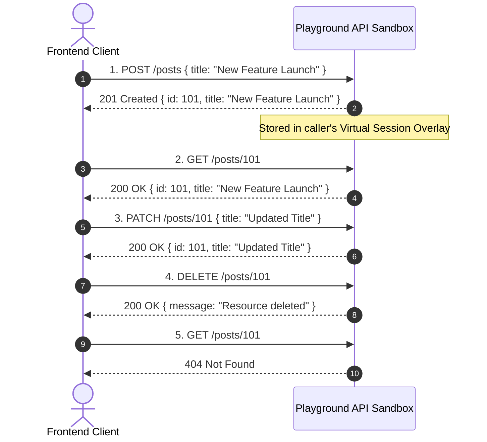

# What If Your Mock API Actually Remembered Your POST Requests?

**Suggested URL Slug:** `mock-api-remember-post-requests`  
**Primary Keyword:** `stateful mock API`  
**Secondary Keywords:** `mock API post request`, `frontend prototype state`, `mock backend testing`, `REST API sandbox`  
**Meta Description:** Discover what happens when a mock API remembers your HTTP POST, PATCH, and DELETE requests per browser session, transforming frontend testing and prototyping.  
**Suggested Dev.to Tags:** `#javascript`, `#react`, `#webdev`, `#testing`

---

Imagine you go to a restaurant. You sit down, look at the menu, and order a cup of coffee. The waiter writes down your order, smiles, and says, *"Order received! Your ticket number is 42."*

Two minutes later, the waiter returns with an empty tray. When you ask where your coffee is, the waiter looks puzzled and says, *"Oh, we acknowledge orders, but we don't actually make them. If you check our menu, it is still the same as when you walked in."*

If this happened in real life, you would leave the restaurant. Yet, as frontend developers, we deal with this exact scenario daily when prototyping against mock APIs.

We send a `POST` request to create a record. The server returns a status code of `201 Created`. But the moment our app navigates back to the dashboard or queries the collection, the server completely forgets that the request ever happened.

What if your mock API actually **remembered** your requests?

---

## The Illusion of Memory in Frontend Prototyping

When testing frontend applications, there are three common workarounds developers use to fake backend memory:

1. **Local Component State (`useState` / `Pinia` / `Vuex`):**  
   You store mock data in client-side arrays. Every time you refresh the page or open a new browser tab, all your modifications reset to initial mock constants.
2. **`localStorage` / IndexedDB Mocks:**  
   You write custom adapter wrappers that save items to `localStorage`. While this persists across reloads, it does not test actual HTTP serialization, headers, HTTP status codes, or asynchronous server latency.
3. **Disposible Local Servers (`json-server` / Express):**  
   You run a local server file on your machine. This works, but it cannot be easily shared with team members, designers, or QA testers reviewing your pull request deployment on Vercel or Netlify.

None of these approaches deliver the experience frontend engineers actually want: **a live, hosted cloud API that remembers mutations per session without requiring local database setup.**

---

## What "Stateful API Mocking" Looks Like in Action

A stateful mock API bridges the gap between static dummy JSON and full production backends. It functions by creating an isolated sandbox for your browser session.

Here is the exact lifecycle:



Every standard HTTP verb functions exactly as it would on a production server:
- **`POST` &rarr; `GET`:** Newly created records immediately appear in collection lists and single-resource queries.
- **`PATCH` / `PUT` &rarr; `GET`:** Updated fields reflect on subsequent queries.
- **`DELETE` &rarr; `GET`:** Deleted items return `404 Not Found` and are excluded from pagination counts.

---

## Step-by-Step Code Walkthrough

Let's test this directly against [Playground API](https://playground.nileslabs.com) by Niles Labs. You can run this directly in your browser console or Node.js environment:

```javascript
const BASE = 'https://playground.nileslabs.com/api/v1';

async function runStatefulDemo() {
  // Step 1: Create a Todo item
  console.log('--- 1. Creating a Todo ---');
  const createRes = await fetch(`${BASE}/todos`, {
    method: 'POST',
    headers: { 'Content-Type': 'application/json' },
    body: JSON.stringify({
      title: 'Review PR #204',
      completed: false,
      user_id: 1,
    }),
  });
  const createdTodo = await createRes.json();
  console.log('Created:', createdTodo);

  // Step 2: Retrieve the newly created Todo by ID
  console.log('\n--- 2. Fetching Created Todo by ID ---');
  const getRes = await fetch(`${BASE}/todos/${createdTodo.id}`);
  const fetchedTodo = await getRes.json();
  console.log('Fetched:', fetchedTodo);

  // Step 3: Toggle the completion state via PATCH
  console.log('\n--- 3. Updating Todo via PATCH ---');
  const patchRes = await fetch(`${BASE}/todos/${createdTodo.id}`, {
    method: 'PATCH',
    headers: { 'Content-Type': 'application/json' },
    body: JSON.stringify({ completed: true }),
  });
  const updatedTodo = await patchRes.json();
  console.log('Updated Status:', updatedTodo.completed); // true

  // Step 4: Delete the Todo
  console.log('\n--- 4. Deleting the Todo ---');
  const deleteRes = await fetch(`${BASE}/todos/${createdTodo.id}`, {
    method: 'DELETE',
  });
  console.log('Delete status:', deleteRes.status); // 200

  // Step 5: Verify it is gone
  console.log('\n--- 5. Verifying Deletion ---');
  const verifyRes = await fetch(`${BASE}/todos/${createdTodo.id}`);
  console.log('Status on deleted item:', verifyRes.status); // 404 Not Found
}

runStatefulDemo();
```

---

## Multi-Tab & Multi-Client Session Isolation

A common question is: *If multiple developers or automated test suites use the API simultaneously, will their POST requests overwrite each other?*

No. Stateful sandbox engines use **session isolation**:
- **In Browser:** An HTTP-only session cookie automatically identifies each browser sandbox.
- **In CI/CD & Automated Tests (Playwright / Cypress):** You can pass a custom header `X-Playground-Identity: test-runner-suite-1` to maintain an isolated sandbox across parallel test runners.
- **Resetting State:** Whenever you want a clean slate, a simple `DELETE /session/reset` request flushes your session overlay and restores the default seed dataset.

---

## Why This Changes Frontend Development

When your mock API behaves like a real backend:
1. **Interactive Client Demos Work:** You can send a live preview link (e.g. on Vercel) to stakeholders or clients, and they can click around, create posts, toggle todos, and delete items without finding broken empty states.
2. **Realistic Query Invalidation:** Tools like React Query, SWR, and Redux Toolkit Query behave naturally when invalidating query caches.
3. **No Database Maintenance:** You spend zero minutes configuring Docker, spinning up Postgres instances, or writing migration scripts for throwaway prototypes.

---

## Conclusion

Mock APIs should do more than echo your requests. By remembering mutations across the entire HTTP lifecycle, stateful sandboxes make frontend prototyping feel authentic and production-ready from the very first commit.

To experiment with persistent mutations in your next application, start testing with [Playground API by Niles Labs](https://playground.nileslabs.com/).
