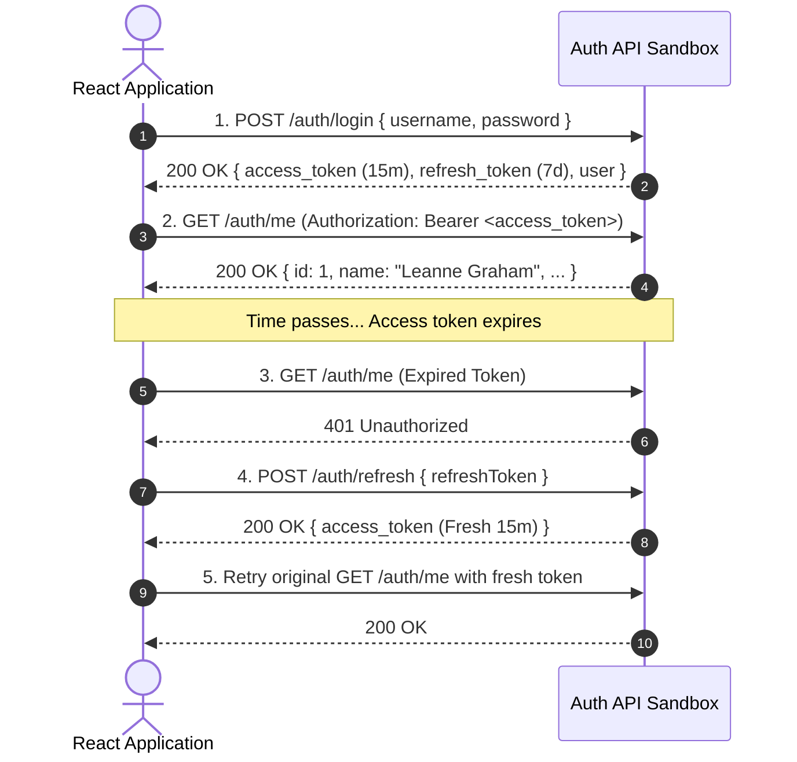

# How to Test JWT Authentication and Silent Token Refresh in React Without a Backend

**Suggested URL Slug:** `test-jwt-auth-and-token-refresh-in-react`  
**Primary Keyword:** `test JWT auth in React`  
**Secondary Keywords:** `silent token refresh Axios`, `React JWT authentication tutorial`, `mock JWT API`, `React protected route test`  
**Meta Description:** Master testing JWT authentication, Bearer tokens, Axios silent refresh interceptors, and protected routes in React using a stateful auth sandbox.  
**Suggested Dev.to Tags:** `#react`, `#auth`, `#security`, `#javascript`

---

Building authentication in a frontend application is notoriously tricky.

Writing the UI form is easy. The hard part is everything that happens under the hood:
- Storing access tokens and refresh tokens securely.
- Attaching `Authorization: Bearer <token>` headers to authenticated requests.
- Intercepting `401 Unauthorized` responses when an access token expires.
- Silently requesting a new access token via `/auth/refresh` without logging the user out or interrupting their work.
- Updating authenticated profile details via `PATCH /auth/me`.

When developing a frontend, you shouldn't have to build an entire Node.js auth microservice with bcrypt, JWT signing secrets, and database tables just to test your React `AuthContext` and Axios interceptor loops.

In this guide, we will explore how modern JWT authentication flows work on the frontend and how to test the entire lifecycle against a production-grade auth sandbox.

---

## The Standard JWT Authentication Architecture

A production frontend authentication flow typically follows this sequence:



---

## The Sandbox Authentication Endpoints

[Playground API](https://playground.nileslabs.com) by Niles Labs provides built-in JWT authentication simulation endpoints under `/api/v1/auth`:

| Endpoint | Method | Payload / Headers | Description |
| :--- | :--- | :--- | :--- |
| `/api/v1/auth/login` | `POST` | `{ username, email, password }` | Authenticates user; returns signed 15-minute `access_token` and 7-day `refresh_token`. |
| `/api/v1/auth/register`| `POST` | `{ name, username, email }` | Creates user in your session overlay and returns auth tokens. |
| `/api/v1/auth/refresh` | `POST` | `{ refreshToken }` | Validates refresh token and issues a fresh `access_token`. |
| `/api/v1/auth/me` | `GET` | `Authorization: Bearer <token>` | Verifies JWT signature and returns the authenticated user profile. |
| `/api/v1/auth/me` | `PATCH`| `Authorization: Bearer <token>` | Updates profile attributes within the caller's session overlay. |

---

## Implementing the Silent Refresh Interceptor with Axios

Let's implement a production-grade Axios client that automatically catches `401 Unauthorized` errors, performs a silent token refresh, and retries the failed request.

### 1. The Authenticated HTTP Client (`httpClient.js`)

```javascript
// src/services/httpClient.js
import axios from 'axios';

const BASE_URL = 'https://playground.nileslabs.com/api/v1';

// In-memory token storage (Best practice for XSS mitigation)
let accessToken = null;
let refreshToken = localStorage.getItem('playground_refresh_token');

export const setTokens = (access, refresh) => {
  accessToken = access;
  refreshToken = refresh;
  if (refresh) {
    localStorage.setItem('playground_refresh_token', refresh);
  } else {
    localStorage.removeItem('playground_refresh_token');
  }
};

export const getAccessToken = () => accessToken;

// Create Axios Instance
export const apiClient = axios.create({
  baseURL: BASE_URL,
  headers: { 'Content-Type': 'application/json' },
});

// Request Interceptor: Attach Bearer token
apiClient.interceptors.request.use((config) => {
  if (accessToken && !config.headers.Authorization) {
    config.headers.Authorization = `Bearer ${accessToken}`;
  }
  return config;
});

// Response Interceptor: Catch 401 and handle silent refresh
apiClient.interceptors.response.use(
  (response) => response,
  async (error) => {
    const originalRequest = error.config;

    // Check if error is 401 and we haven't already retried
    if (error.response?.status === 401 && !originalRequest._retry && refreshToken) {
      originalRequest._retry = true;

      try {
        // Request fresh access token
        const refreshRes = await axios.post(`${BASE_URL}/auth/refresh`, {
          refreshToken: refreshToken,
        });

        const newAccessToken = refreshRes.data.access_token;
        setTokens(newAccessToken, refreshToken);

        // Update Authorization header and retry original request
        originalRequest.headers.Authorization = `Bearer ${newAccessToken}`;
        return apiClient(originalRequest);
      } catch (refreshErr) {
        // Refresh token failed or expired -> log out user
        setTokens(null, null);
        window.location.href = '/login';
        return Promise.reject(refreshErr);
      }
    }

    return Promise.reject(error);
  }
);
```

---

### 2. The React `AuthContext` Provider (`AuthContext.jsx`)

```jsx
// src/context/AuthContext.jsx
import React, { createContext, useContext, useState, useEffect } from 'react';
import { apiClient, setTokens, getAccessToken } from '../services/httpClient';

const AuthContext = createContext(null);

export function AuthProvider({ children }) {
  const [user, setUser] = useState(null);
  const [loading, setLoading] = useState(true);

  // Fetch current user on startup if token exists
  useEffect(() => {
    const initAuth = async () => {
      const storedRefresh = localStorage.getItem('playground_refresh_token');
      if (storedRefresh) {
        try {
          // Attempt token refresh on boot
          const refreshRes = await apiClient.post('/auth/refresh', {
            refreshToken: storedRefresh,
          });
          setTokens(refreshRes.data.access_token, storedRefresh);
          
          // Fetch authenticated profile
          const meRes = await apiClient.get('/auth/me');
          setUser(meRes.data);
        } catch {
          setTokens(null, null);
        }
      }
      setLoading(false);
    };

    initAuth();
  }, []);

  // Login action
  const login = async (username, password) => {
    const res = await apiClient.post('/auth/login', { username, password });
    setTokens(res.data.access_token, res.data.refresh_token);
    setUser(res.data.user);
    return res.data.user;
  };

  // Logout action
  const logout = () => {
    setTokens(null, null);
    setUser(null);
  };

  return (
    <AuthContext.Provider value={{ user, login, logout, loading }}>
      {children}
    </AuthContext.Provider>
  );
}

export const useAuth = () => useContext(AuthContext);
```

---

### 3. Protected Route Wrapper (`ProtectedRoute.jsx`)

```jsx
// src/components/ProtectedRoute.jsx
import React from 'react';
import { useAuth } from '../context/AuthContext';

export default function ProtectedRoute({ children }) {
  const { user, loading } = useAuth();

  if (loading) {
    return <div style={{ padding: '2rem' }}>🔒 Verifying session...</div>;
  }

  if (!user) {
    return (
      <div style={{ padding: '2rem', color: '#dc2626' }}>
        <h3>🚫 Access Denied</h3>
        <p>Please log in to view this protected dashboard.</p>
      </div>
    );
  }

  return children;
}
```

---

## 3 Best Practices for Frontend JWT Security

1. **Keep Access Tokens in Memory:**  
   Never store short-lived access tokens in `localStorage` where they are vulnerable to Cross-Site Scripting (XSS). Store access tokens in a JavaScript variable or React Context.
2. **Prevent Refresh Token Storms (Queue Retries):**  
   If multiple simultaneous requests fail with 401, ensure only **one** `/auth/refresh` request is triggered while other pending requests wait in a queue.
3. **Handle Expired Refresh Tokens Gracefully:**  
   If the refresh token itself is invalid or expired, immediately clear client state and redirect the user to the login screen with a friendly message.

---

## Conclusion

Authentication doesn't have to be a blind spot in your frontend development workflow. By pairing a robust Axios interceptor with a real JWT sandbox that verifies tokens and simulates refresh lifecycles, you can test and bulletproof your authentication flows without writing a line of backend auth code.

Test JWT login, refresh tokens, and protected routes with [Playground API by Niles Labs](https://playground.nileslabs.com/).
